```{r setup, include=FALSE}
# This report reads the outputs of the analysis scripts (run_all.R) - it does not
# re-run the slow steps. Re-run the scripts first if the data change.
knitr::opts_chunk$set(echo = FALSE, message = FALSE, warning = FALSE,
                      fig.align = "center", out.width = "95%")
suppressPackageStartupMessages({ library(dplyr); library(knitr) })
rev      <- readRDS("data/reviews_clean.rds")
games    <- readRDS("data/games.rds")
hist     <- readRDS("data/hist_monthly.rds")
spikes   <- read.csv("data/spikes.csv")
summ     <- read.csv("data/summary_by_game.csv")
stats    <- read.csv("data/stats_results.csv")
cent     <- read.csv("data/network_centrality.csv")
comm     <- readRDS("data/network_communities.rds")
clusters <- readRDS("data/review_clusters.rds")
profiles <- readRDS("data/game_profiles.rds")
dtm_info <- readRDS("data/dtm.rds")$dtm
raw_n    <- nrow(read.csv("data/steam_reviews.csv", encoding = "UTF-8"))
fmt <- function(x) format(x, big.mark = ",")
pct <- function(x, d = 0) paste0(round(100 * x, d), "%")
# LaTeX table: booktabs, kept in place ([H]), small font, optional fixed column widths
ktab <- function(df, caption, spec = NULL, small = TRUE) {
  x <- kable(df, format = "latex", booktabs = TRUE, linesep = "", caption = caption,
             format.args = list(big.mark = ","))
  x <- sub("\\\\begin\\{table\\}", "\\\\begin{table}[!htbp]", x)
  if (small) x <- sub("\\\\centering", "\\\\centering\\\\small", x)
  if (!is.null(spec)) x <- sub("\\\\begin\\{tabular\\}(\\[t\\])?\\{[^}]*\\}",
                               paste0("\\\\begin{tabular}{", spec, "}"), x)
  x
}
multi <- rev %>% group_by(user) %>% filter(n_distinct(game) >= 2) %>% ungroup()
cons  <- multi %>% group_by(user) %>% summarise(s = mean(recommended == "Negative"))
```

<!-- Knit in RStudio (Knit -> PDF) from the project folder, or:
     Rscript -e "rmarkdown::render('COMP3020_Report.Rmd')"
     Numbers in the text are computed from the data files where possible. -->

# Abstract {.unnumbered .unlisted}

Steam reviews are a way to give players a chance to voice their feedback on games and to complain about developer or publisher decisions. This study explores review bombing on 24 Steam games to answer the questions of when negative reviews rise, what do players complain about, how do reviewers relate across games and how do negative reviewers differ from positive reviewers about the games they review. Time-series exploration, text mining, k-means clustering, network analysis and statistical tests were used to analyse the English-language reviews and the number of reviews by month.

The graph reveals that a number of the negative reviews have come in around the same time that big platform or publisher moves have occurred, whereas no control games with a high score have matched that pattern under our detection rule. The nine main themes of complaints identified during text analysis were cheating, monetisation, technical issues, among others. The network analysis revealed three groups of reviewers who have seen several games, indicating relationships in and between the player groups and the complaints made about the various games. There were also differences between negative and positive reviewers in how long it took them to play, the length of their reviews and the number of times they were voted on during their reviews.

The overall results indicate that negative Steam reviews may be a result of discontent with a game or a response to broader game decisions made by the game developer. A consideration of the time of the review, the themes of complaints and relationships between reviewers can then give a broader picture of player feedback.

\vspace{1em}
\tableofcontents
\newpage

# 1. Introduction

Steam is one of the biggest platforms for PC games, where players can share their opinion via reviews. They can "Recommend" or "Not recommend" a game, and explain why, and they can vote on whether other reviews are helpful or funny. These reviews also add to the overall rating on each game page, which can impact would-be purchasers. User-generated, public Steam reviews are time-stamped, and linked to users' accounts, which makes them valuable tools to analyze how people interact and express opinions online.

But, not every player uses reviews to write about the game's quality. At times, they are used to voice opposition to the decisions made by developers or publishers. This can be referred to as a "review bomb" in which a large number of negative reviews are posted in a short amount of time. Helldivers 2 is an example of this. Sony announced in May of 2024 that Steam players will have to connect with a PlayStation Network (PSN) account. The announcement was greeted with a good amount of backlash, and Sony had its decision reversed (Game Informer, 2024; Game World Observer, 2024). Valve has also implemented measures to detect and prevent review bots from skewing the scores of a game in a review only if they are reviewing content that doesn't fit the game's genre (Variety, 2019).

These reactions are important to understand for various groups. Players, developers and publishers can both learn what they can to avoid decisions that might cause player dissatisfaction. Steam also has to be able to separate out criticism of a game's quality from protests about a broader issue. Potential buyers can be better informed of why players are giving ratings, and how to interpret them.

This project analyzes how players experienced 24 Steam games that were linked to public debates. It seeks to ask what people complain about, which games do they review, which reviewers do these games share, and what is the difference between negative and positive reviewers. We examine how the reviews change over time, we review the use of text mining and clustering to discover themes of complaints and we use network analysis to investigate the relationships between players and games. A comparison of negative and positive reviewers is then made through the use of statistical tests, keeping in mind the constraint of the samples used.

**Research questions**

- **RQ1 (Section 4)** When do negative reviews spike, and do the spikes coincide with identifiable controversies?
- **RQ2 (Section 5)** Which words distinguish negative from positive reviews, and what is distinctive about each game's reception?
- **RQ3 (Section 6)** What types of complaint appear in negative reviews, and do different games fail in the same way?
- **RQ4 (Section 7)** Do the same players review several of these games, do the games form player communities, and are games that share players criticised for the same things?
- **RQ5 (Section 8)** How do negative reviewers differ from positive ones (playtime, review length, helpfulness, free copies)?

# 2. Data Collection and Ethics

## 2.1 Source and collection

The data was gathered from three public Steam Store endpoints that do not require an API key (Valve Corporation, n.d.). The appreviews endpoint returned the review content and related information, appreviewhistogram returned the number of reviews per month (both positive and negative), and appdetails returned the game information. We collected English reviews using the Python script collect_steam.py, which we also included reviews from Steam's off-topic review activity periods (filter_offtopic_activity=0), since these periods are relevant to our study of review bombing.

We gathered as many reviews as possible for each game – up to 1,500 that were rated as helpful and 500 of the newest reviews. This resulted in a total of r fmt(raw_n) reviews. Review text, recommendations, timestamps, helpful and funny votes, free copy and number of games owned were collected. The review text data set is only for English reviews, while the monthly histogram includes reviews in all languages. For instance, the histogram for Overwatch 2 had 465,000 reviews while the English language version of Overwatch 2 had 171,000.

## 2.2 Choice of games

24 games were chosen because of their relevance to the research questions and not by random sampling. There were 17 games which had garnered broad interest and controversy between 2016 and 2025. These controversies included platform and account policies (Helldivers 2, Ghost of Tsushima), launch performance issues (Cities: Skylines II, Monster Hunter Wilds, Borderlands 4, Battlefield 2042), monetisation and live-service design (Overwatch 2, Diablo IV, Skull and Bones, Suicide Squad: Kill the Justice League), always-online requirements (Payday 3), cheating and bots (Team Fortress 2, Counter-Strike 2), disappointing launches (Starfield, Redfall, Assassin's Creed Shadows), and a boycott campaign (Hogwarts Legacy).

Additionally, four games were added that were met with extremely positive reviews: Baldur's Gate 3, Elden Ring, Palworld and Kingdom Come: Deliverance II. These games are used to see how well the analysis separates out controversy-related from generally favourable reception. The three other games—Cyberpunk 2077, No Man's Sky and Fallout 76—were chosen as redemption games as they faced below-average launches and have bounced back with enhancements.

Given the purposeful selection of cases, the results will be most applicable to these high-profile cases. Do not consider them to be representative of every game available on Steam.

```{r games-table}
g <- games %>% select(game, release_date, genres, review_score_desc, total_reviews) %>%
  mutate(genres = gsub("\\|", ", ", genres), total_reviews = fmt(total_reviews)) %>%
  arrange(game)
names(g) <- c("Game", "Release", "Genres", "Steam rating", "Reviews")
ktab(g, "The 24 games studied (Steam metadata on 29 Sep 2026; Reviews = English reviews). Counter-Strike 2 shows the release date of CS:GO, which it replaced on the same store page; Palworld shows its 1.0 release after early access.",
     "p{4.1cm}lp{4.9cm}p{2.9cm}r")
```

## 2.3 Ethics and privacy

All data will be accessible to anyone on the Steam store without logging in. They were retrieved for academic purposes only, with Steam's documented endpoints taking about 1 request per second typical browser traffic. Prior to being written to disk, each reviewers Steam ID was replaced by a 16 character salted sha256 hash. The hash is used to identify the same reviewer for the network analysis and to recognise them across games. The salt is never included in the code that is submitted and is kept private, which means that the hashes can't be matched back to accounts and user names, avatars and profile links weren't ever stored. No review text is included in the report and only aggregated results are shown.

Reviewers post them openly and would appreciate other buyers reading their reviews, but they are unlikely to expect that the reviews of different games will be linked. Reporting network measures instead of for individuals, and hashing the ID, keeps that linkage anonymous. The data are kept only for the purposes of this assignment.

# 3. Data Cleaning and Exploration

## 3.1 Cleaning

```{r cleaning-numbers}
n_removed <- raw_n - nrow(rev)
```

There were `r fmt(raw_n)` raw data reviews. We filtered out reviews from the Steam language filter that were empty or contained very little ASCII letters, ASCII artwork or non-English text, such as ASCII art. The BBCode tags, such as [h1] and [spoiler] and urls were deleted from the review text. A few very short reviews (less than 10 words) were kept when analysing the recommendation behaviour while only longer ones (more than 10 words) were used in the text mining and clustering. We took the steam review counts for games released in the last 7 days and the last 30 days as applicable for every game and summarized them by calendar month.

## 3.2 Overview of the sample

```{r summary-table}
s <- summ %>% transmute(Game = game, Reviews = reviews, `Text-mined` = text_ok,
                        `Neg. (sample)` = pct(sample_neg), `Neg. (Steam)` = pct(true_neg_share),
                        `Med. words` = round(median_words), `Med. hours` = round(median_playtime_h))
ktab(s, "Reviews collected per game, ordered by the share of negative reviews in our sample. Neg. (Steam) = true lifetime negative share of English reviews; Med. hours = median hours played when the review was written.",
     "lrrrrrr")
```

The games have been received differently. For our sample, the negative share varies between 6% for Ghost of Tsushima and 78% for Overwatch 2, while the range for all English reviews is between 3% for Baldur's Gate 3 and 61% for Redfall. The game play time varies between 5 hours (Redfall) and 464 hours (Team Fortress 2) and 609 hours (Counter-Strike 2) at the time of this writing. The reviews of long running competitive games are done by very experienced players and when a game fails a review is usually done within a few hours. The number of words in a median review ranges from 45 words (for games such as Counter-Strike 2, Ghost of Tsushima) to more than 100 words (for games like Starfield, Cyberpunk 2077).

```{r fig-bias, fig.cap="Negative share in our sample vs the true lifetime negative share of English reviews reported by Steam.", out.width="48%"}
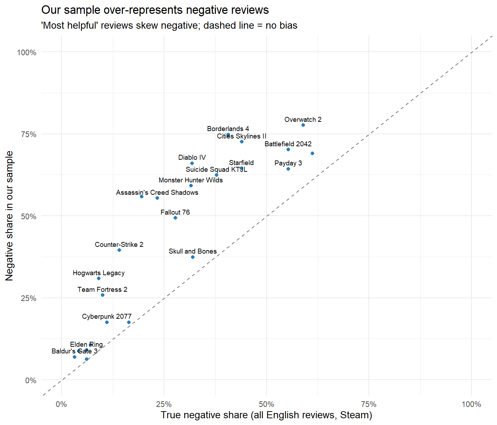
```

```{r bias-numbers}
b <- summ %>% mutate(d = sample_neg - true_neg_share)
```

Our sample over-represents negative reviews by on average `r round(100 * mean(b$d), 1)` percentage points, as Steam's most helpful reviews are actually negative (as confirmed in Section 8, H3). The order of the games is still maintained, however (r = `r round(cor(summ$sample_neg,summ$true_neg_share), 2)`). Therefore a true proportion is always calculated from lifetime histogram (Section 4) and tests on reviewer behaviour are always based on the recent-review sample (Section 8).

These observations guided the subsequent analysis. Playtime is very skewed to the right and is therefore plotted on a log scale and compared to rank-based (Wilcoxon) tests instead of t-tests. The games' reviews were stripped of their own specific vocabulary (character, studio and title names) before clustering (Section 5.1); otherwise the clusters would simply recapture the games' vocabulary. As each game has a different number of complaints, the negative share varies wildly from game to game, so complaint types are compared as a proportion within each game (complaint profiles, Section 6.3) instead of as an absolute number.

# 4. Time Trends: Detecting Review Bombs (RQ1)

## 4.1 Method

To calculate the monthly percentage of negative reviews in each game, we took the ratio of the number of negative reviews in a month to the total number of reviews for the game over all of Steam's history (all languages, not our sample). A negative share of at least 20 percentage points higher than the median month for the game was considered a negative spike, and the month had to have at least 200 reviews and the game's median monthly volume to avoid being ignored because of being a small, noisy month.

Since the median is not unduly influenced by the outliers, or peaks, it can be used as a base. The quietness of a month (or year) is not marked because of the volume condition. Redfall, for instance, has had fewer than 20 reviews in a month since they were launched, and thus their monthly share is randomly between 0% and 85% (Figure 3). The 20 point threshold is a subjective one. Table 3 indicates that as the threshold increases, there will be a decline in flagged months, although the number of games for a spike of 13 to 16 flagged points remains fairly constant. The largest increases discussed below (TF2, Helldivers 2, Overwatch 2, No Man's Sky, Monster Hunter Wilds, and Battlefield 2042) are found at all the thresholds up to 30 points; smaller ones like Counter-Strike 2 in October 2023 (+27 points) and Cities: Skylines II in 2024 (+21 to +25) vanish at the most stringent thresholds.

```{r sensitivity}
detect <- function(h, j) h %>% group_by(game) %>%
  mutate(sp = (neg_share - median(neg_share)) >= j & total >= median(total) & total >= 200) %>% ungroup()
sens <- do.call(rbind, lapply(c(.10, .15, .20, .25, .30), function(j) {
  s <- detect(hist, j); data.frame(Threshold = paste0("+", 100 * j, " pts"),
                                   `Spike months` = sum(s$sp), `Games with a spike` = n_distinct(s$game[s$sp]),
                                   check.names = FALSE) }))
ktab(sens, "Sensitivity of spike detection to the threshold.")
```

## 4.2 Results

We detected `r nrow(spikes)` spike-months in `r n_distinct(spikes$game)` of the 24 games. None of the four control games (Baldur's Gate 3, Elden Ring, Palworld, Kingdom Come: Deliverance II) had a spike.

```{r top-spikes}
top <- spikes %>% arrange(desc(excess)) %>% head(10) %>%
  transmute(Game = game, Month = format(as.Date(month), "%b %Y"), Negative = down, Total = total,
            `Negative share` = pct(neg_share), `Above median` = paste0("+", round(100 * excess), " pts"))
ktab(top, "The ten largest negative spikes (all review languages).")
```

```{r fig-key, fig.cap="Monthly negative share for six games with documented controversies. Red points are detected spikes; dotted lines mark the events.", out.width="85%"}
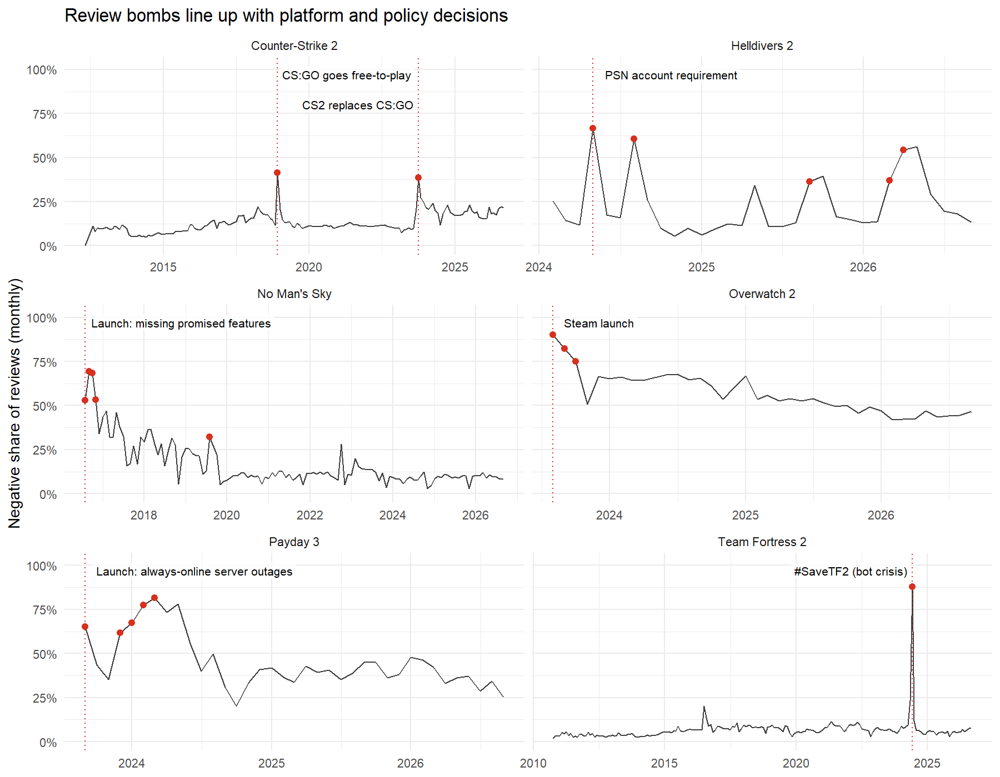
```

The largest spikes match documented events:

- **Team Fortress 2, June 2024** (88% of 52,529 reviews negative, +82 points): the #SaveTF2/#FixTF2 campaign asking Valve to deal with cheating bots that had made public servers unplayable (PC Gamer, 2024a).
- **Helldivers 2, May 2024** (228,757 negative reviews in one month): Sony's PSN account-linking requirement, withdrawn on 6 May (Game Informer, 2024). A second spike in August 2024 could not be linked to a single documented event.
- **Overwatch 2, August 2023** (90% negative): the game's Steam launch, which players used to protest against the cancelled PvE mode and its monetisation (GameSpot, 2023). A large share of these reviews came from Chinese players who had lost access to the game in China (Game World Observer, 2023), which our all-language histogram includes.
- **Counter-Strike 2**: the method flagged **December 2018** without being told about it. This was the month CS:GO went free-to-play, with more than 14,000 negative reviews in one day (PC Gamer, 2018). It also flagged **October 2023**, when Counter-Strike 2 replaced CS:GO on the same store page (Kain, 2023).
- **Payday 3, September 2023 onwards**: an always-online launch whose servers failed, so even solo players could not play (PC Gamer, 2023).
- **No Man's Sky, August–November 2016**: a launch missing features that had been shown or promised before release (Kain, 2016).
- **Cities: Skylines II, February–April 2024**: coincides with the Beach Properties DLC, which was released while known bugs remained unfixed and which the developers later refunded and apologised for (PC Gamer, 2024b).
- **Monster Hunter Wilds, May–October 2025**: PC performance that players reported getting worse after updates, pushing recent reviews to "Overwhelmingly Negative" (Windows Central, 2025).

The triggers fall into three kinds: **platform and business decisions** (PSN linking, CS:GO going free-to-play, CS2 replacing CS:GO, Overwatch 2's monetisation), **technical failures** (Payday 3's servers, the performance of Monster Hunter Wilds and Cities: Skylines II, bots in Team Fortress 2), and **launches that did not match their promises** (No Man's Sky, Battlefield 2042).

The kinds of trigger also tend to differ in how long the negativity lasts. Protests against a single decision are short: Helldivers 2's PSN spike, Team Fortress 2's bot protest and both Counter-Strike spikes were each flagged in a single month, after which the negative share returned close to its baseline. Spikes caused by technical problems or a poor launch last longer, until the problem is fixed: six consecutive months for Monster Hunter Wilds, five for Battlefield 2042, four for No Man's Sky and three for Cities: Skylines II, while Payday 3 was flagged in five of its first seven months. Overwatch 2 is an exception to this pattern: its protest over monetisation and the cancelled PvE mode stayed above baseline for three months, probably because the grievance was ongoing rather than a single reversible decision. The redemption games show what follows. No Man's Sky fell from 50–70% negative in 2016 to around 10% from 2020 onwards (Figure 3), which supports the view that the method responds to real changes in player sentiment rather than noise.

Timing shows *when* players push back but not *what* they complain about; Sections 5 and 6 examine the content of the reviews.

```{r fig-all, fig.cap="Monthly negative share for all 24 games (dashed = median month, red = spike).", out.width="70%"}
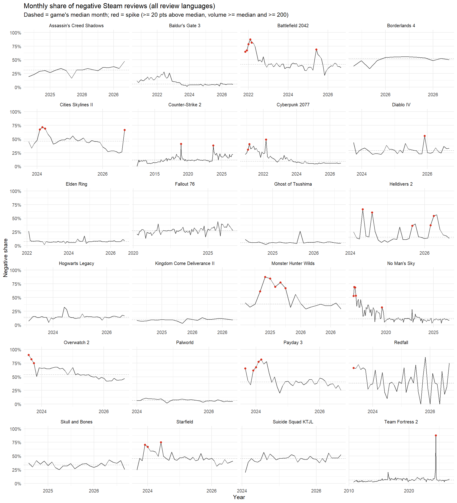
```

# 5. Text Mining (RQ2)

## 5.1 Pre-processing

Using the `tm` package (Feinerer et al., 2008), the `r fmt(sum(rev$text_ok))` reviews with at least 10 words were converted to lower case; punctuation, numbers and English stop words were removed, and words were stemmed with the Porter stemmer (Porter, 1980). We also removed words that appear in almost every game review ("game", "play", "hours") and **words from game titles** ("helldivers", "cyberpunk"), since these would otherwise dominate the analysis and clustering would simply recover which game a review is about. Company names (Sony, Ubisoft, Valve...) were kept because they are often the target of complaints. Terms appearing in fewer than 0.5% of reviews were dropped, leaving a document-term matrix of `r fmt(dtm_info$nrow)` reviews by `r fmt(dtm_info$ncol)` terms.

## 5.2 Words that separate negative from positive reviews

For each term we computed the smoothed log-odds ratio of its relative frequency in negative versus positive reviews (Monroe et al., 2008). Positive values mean the term is more typical of negative reviews.

```{r fig-lor, fig.cap="Terms most over-represented in negative (left) and positive (right) reviews.", out.width="85%"}
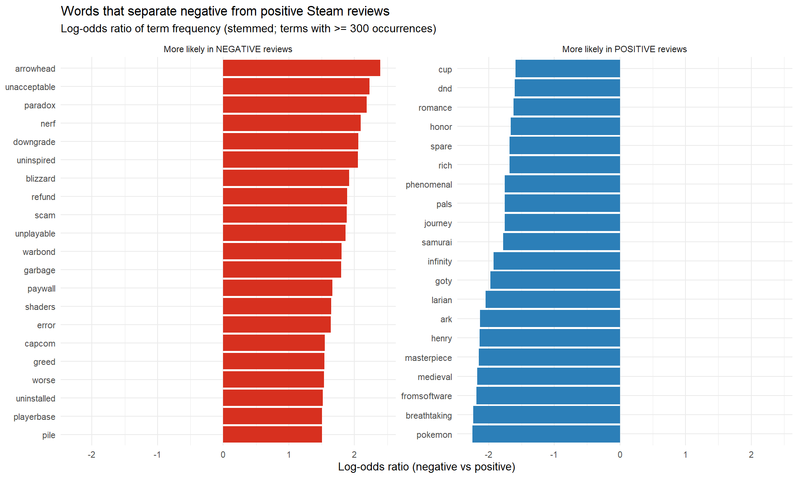
```

The complaint vocabulary falls into four groups. First, negative reviews **name the company**: arrowhead, paradox, blizzard, capcom and gearbox are all among the 25 terms most typical of negative reviews, which suggests that dissatisfied players blame the developer or publisher rather than the game. Second, **money**: refund, scam, greed, paywall and warbond (Helldivers 2's paid item track). Third, **technical failure**: unplayable, error, shader, worse and uninstalled. Fourth, **changes made after release**: nerf, downgrade and ban.

Positive reviews use aesthetic and emotional language instead (masterpiece, breathtaking, phenomenal, journey, GOTY), and also name the studios behind well-received games (larian, fromsoftware). Company names therefore appear on both sides; what differs is which company. Overall, negative reviews tend to be about decisions and conditions *around* a game (price, monetisation, stability, balance changes), while positive reviews are about the experience itself. Section 6 tests this more directly.

## 5.3 What is distinctive about each game (TF-IDF)

Treating all reviews of a game as one document, TF-IDF highlights words frequent in one game's reviews but rare in the others. Raw term frequency would rank words like "combat" or "weapons" highly for many games; TF-IDF down-weights terms that occur in many games' reviews, so each list shows what is specific to that game.

```{r fig-tfidf, fig.cap="Six most distinctive words per game (TF-IDF with each game as a document).", out.width="76%"}
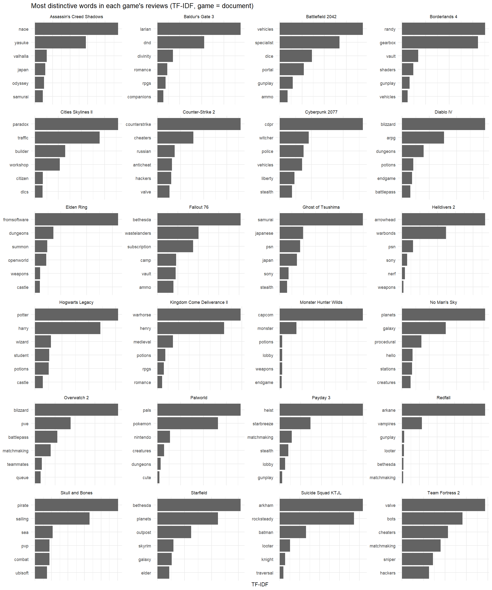
```

Several results connect directly to Section 4:

- **"psn" and "sony"** are among the most distinctive terms for both Helldivers 2 and Ghost of Tsushima: the same account policy affected two different games. Only Helldivers 2 has a spike. Ghost of Tsushima launched on Steam on 16 May 2024 with a PSN account already required for its online mode, and was delisted in about 177 countries without PSN (PC Gamer, 2024c). Its PSN complaints therefore started in its launch month, which becomes part of its baseline, rather than appearing as a sudden change.
- **"bots", "cheaters" and "hackers"** define Team Fortress 2, and "cheaters", "anticheat" and "hackers" define Counter-Strike 2.
- Overwatch 2's reviews are distinguished by **"pve", "battlepass" and "paywall"**, Borderlands 4's by **"shaders"**, a PC-performance term, and Fallout 76's by **"subscription"**.

For the well-received games, the distinctive words describe content (characters, setting, genre) rather than business or technical issues. A limitation of this bag-of-words approach is that it ignores word order, so "not bad" counts as "bad", and stemming occasionally merges different words.


```{r fig-wordcloud, fig.cap="Frequent words in negative and positive Steam reviews.", out.width="75%"}
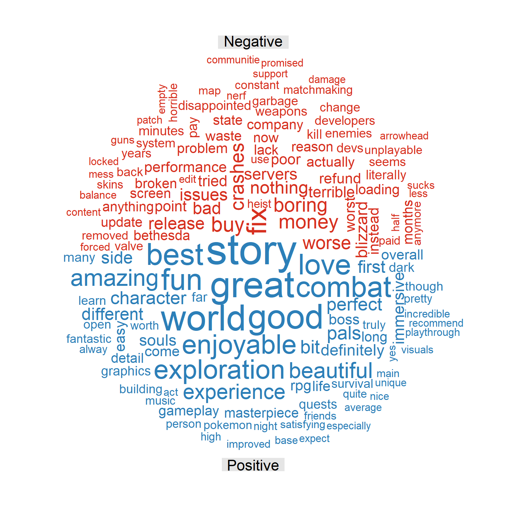
```

# 6. Clustering Complaint Types (RQ3)

## 6.1 Method

We grouped together the negative reviews from the 'r fmt(nrow(clusters))' that had at least one term retained. The TF-IDF vector of each review (terms appearing in at least 1% of negative reviews) was normalized by its length, making the Euclidean k-means algorithm equidistant to group reviews based on cosine similarity and not dominated by long reviews.

```{r fig-k, fig.cap="Total within-cluster sum of squares and average silhouette width (3,000-review sample) for k = 2 to 14.", out.width="72%"}
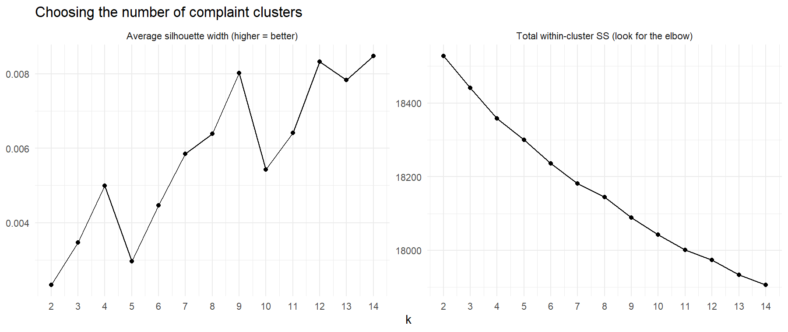
```

None of these two are definitive. The within cluster sum of squares is decreasing smoothly from k = 2 to 14, and is very narrow at all k (at most, 0.008). This is common for short sparse documents: in most reviews, there are a number of topics, and they often have many similar terms, which leads to a lot of overlaps in clusters.

We selected k for interpretability and stability, therefore. Each cluster needed to do a theme that could be identified with the primary terms of the cluster and the themes needed to be repeated after restarting k-means with alternative random centers (`stability_check.R`). In the case of k = 8, seven themes were found in both runs, while the eighth theme appeared in both runs, but in different clusters: "always-online & servers" and "space & exploration", with nearly identical within-cluster sums of squares (18,132.5 and 18,133.5). Both are valid themes and so we chose k = 9, which will accommodate both. There were two runs for k = 9, agreeing with a modified Rand index of 0.67, indicating moderate agreement (Hubert & Arabie, 1985). We selected the run with the minimum sum of squares within clusters (18,083.1), and each cluster was named based on the most prevalent terms within it, all of which were selected from the nine themes.

## 6.2 The nine complaint types

```{r fig-terms, fig.cap="Top terms (centroid TF-IDF weight) of each complaint cluster.", out.width="92%"}
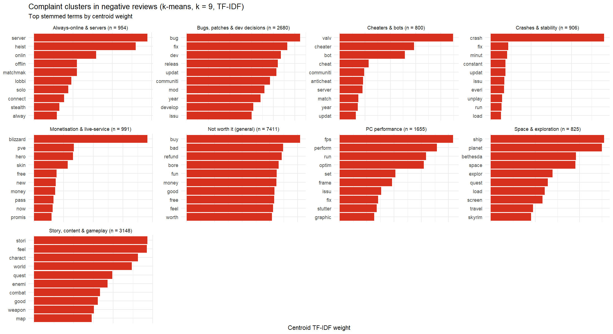
```

```{r cluster-sizes}
cs <- clusters %>% count(cluster, name = "Reviews") %>% mutate(Share = pct(Reviews / sum(Reviews), 1)) %>%
  arrange(desc(Reviews)) %>% rename(`Complaint type` = cluster)
ktab(cs, "Size of each complaint cluster (negative reviews).")
```

## 6.3 Do games fail in the same way?

Each game's **complaint profile** is the share of its negative reviews in each cluster. Games were then grouped by hierarchical clustering (Euclidean distance, Ward linkage) of their profiles, excluding the general "not worth it" cluster that all games share.

```{r fig-heat, fig.cap="Share of each game's negative reviews in each complaint cluster.", out.width="74%"}
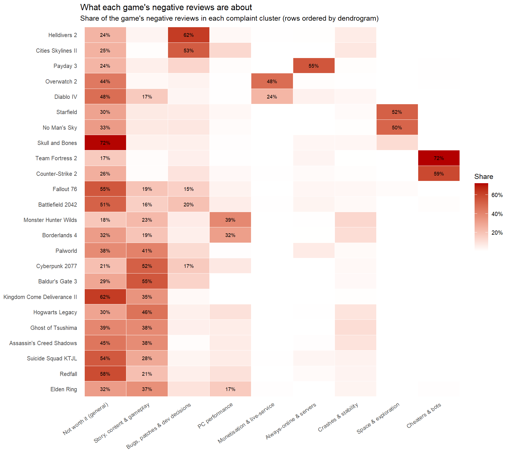
```

```{r fig-dend, fig.cap="Games grouped by their complaint profiles (Ward's method, four groups).", out.width="60%"}
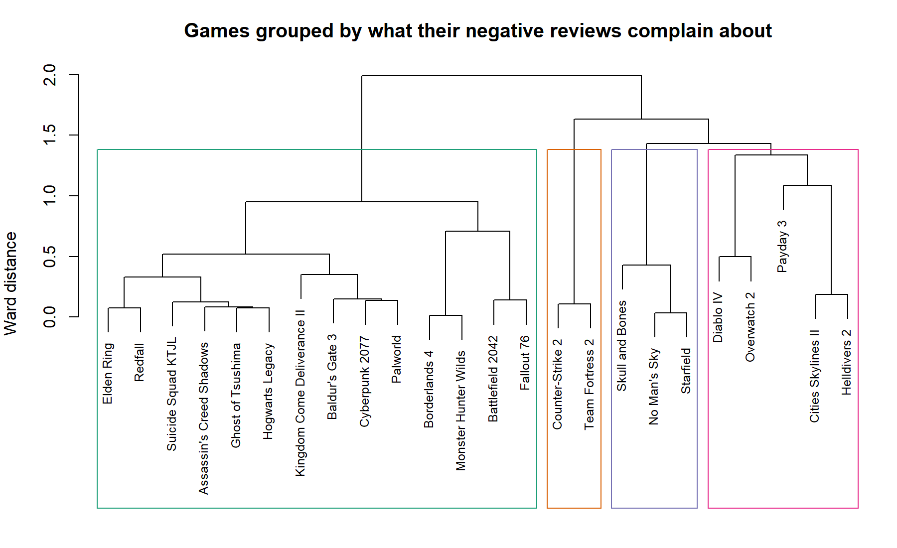
```

Three results stand out. First, apart from the general "not worth it" cluster, which every game has (from 17% of negative reviews for Team Fortress 2 to 72% for Skull and Bones), **most games are dominated by one specific complaint**:

| Complaint type | Games most affected (share of their negative reviews) |
|---|---|
| Cheaters & bots | Team Fortress 2 (72%), Counter-Strike 2 (59%) |
| Bugs, patches & dev decisions | Helldivers 2 (62%), Cities: Skylines II (53%) |
| Always-online & servers | Payday 3 (55%) |
| Space & exploration | Starfield (52%), No Man's Sky (50%) |
| Monetisation & live-service | Overwatch 2 (48%), Diablo IV (24%) |
| PC performance | Monster Hunter Wilds (39%), Borderlands 4 (32%) |

There's a different way each game fails.

Secondly, **the complaints are consistent with the events in Section 4**. Games that had spikes due to technical issues (Payday 3, Monster Hunter Wilds, Cities: Skylines II) are mostly dominated by complaints regarding the servers, performance and/or patches. The cheater cluster dominates the two Valve shooters, who followed suit after cheating was an issue in the game. Helldivers 2 doesn't have an extra PSN cluster, but instead, it is broken down into "bugs, patches & dev decisions" which has balance changes (also known as “nerf” changes) and how the developer handles updates. The account-policy protest was a relatively brief one, and overall, it is the only protest to be overshadowed by the update complaints in our mostly helpfulness-sorted sample.

Third, story-driven games are faulted on their content. “Story, content & gameplay” complaints are the most prevalent in Baldur's Gate 3 (55%), Cyberpunk 2077 (52%) and Hogwarts Legacy (46%) – meaning that these are the games that are not faulted for business or technical choices, but instead for creative content.

The dendrogram divides the data into four clusters:

A large amount of games that have received significant criticism for content or in general, along with games that have affected their performance like Monster Hunter Wilds and Borderlands 4 (which have high content shares in their profile);
2. those games that have players complaining about updates (Helldivers 2, Cities: Skylines II, Payday 3, Overwatch 2, Diablo IV);
3. the two cheater-dominated Valve shooters;
4. the space-exploration games (Starfield, No Man's Sky) together with Skull and Bones.

The two drawbacks of k-means are that a review can be placed in only one cluster even if it discusses multiple issues, and that each cluster must be of relatively uniform size. An LDA topic model would enable a review to interweave multiple complaints.

# 7. Network Analysis (RQ4)

## 7.1 Building the network

Because Steam IDs were hashed consistently, the same reviewer can be recognised across games. `r fmt(n_distinct(multi$user))` reviewers in our sample reviewed two or more of the 24 games (one reviewed 15). We built a **bipartite user–game graph** and projected it onto the games: two games are linked with weight equal to the number of reviewers they share.

Raw shared-reviewer counts mainly reflect popularity. Cyberpunk 2077 and Baldur's Gate 3 share reviewers with almost every game, so the projected graph was nearly complete (273 of 276 possible edges). We therefore re-weighted every edge by its **lift**: the observed number of shared reviewers divided by the number expected if multi-game reviewers chose games independently in proportion to their popularity. A lift above 1 means the two games share more players than their popularity alone predicts.

## 7.2 Centrality

```{r centrality}
ct <- cent %>% head(8) %>% transmute(Game = game, `Shared reviewers (strength)` = strength,
                                    Betweenness = round(betweenness, 3), PageRank = round(pagerank, 3),
                                    `Negative (sample)` = pct(neg_share))
ktab(ct, "Most central games in the shared-reviewer network (top 8 by strength).")
```

Four centrality measures describe different kinds of importance:

- **Degree** counts a game's neighbours. Almost every game is linked to every other (degree 21–23), so it cannot separate them.
- **Strength** sums the edge weights, i.e. the number of shared reviewers.
- **Betweenness** (computed with distance = 1/weight) measures how often a game lies on the shortest paths between other games.
- **PageRank** gives more importance to games that share reviewers with other well-connected games.

By strength and PageRank, the most central games are the large, well-reviewed single-player titles: Cyberpunk 2077 (530 shared reviewers), Hogwarts Legacy, Baldur's Gate 3 and Elden Ring. Cyberpunk 2077 also has by far the highest betweenness (0.42; no other game exceeds 0.08), so it is the main bridge between otherwise separate audiences. A likely explanation is that these are among the best-selling games in the set and are played by many kinds of player, so people who review a niche controversial game have often also reviewed one of these hits. Their centrality is therefore largely a popularity effect, which is why the lift correction is needed for community detection.

## 7.3 Player communities

```{r comm-table}
ct2 <- comm %>% group_by(community) %>% summarise(Games = paste(game, collapse = ", ")) %>%
  rename(Community = community)
ktab(ct2, "Communities found by the Louvain method on the lift-weighted network.", "cp{14cm}")
```

```{r fig-net, fig.cap="Games that share more reviewers than their popularity predicts (edges with lift >= 1.3 shown). Colour = Louvain community; node size = total shared reviewers; red border = more than 50% negative in our sample.", out.width="68%"}
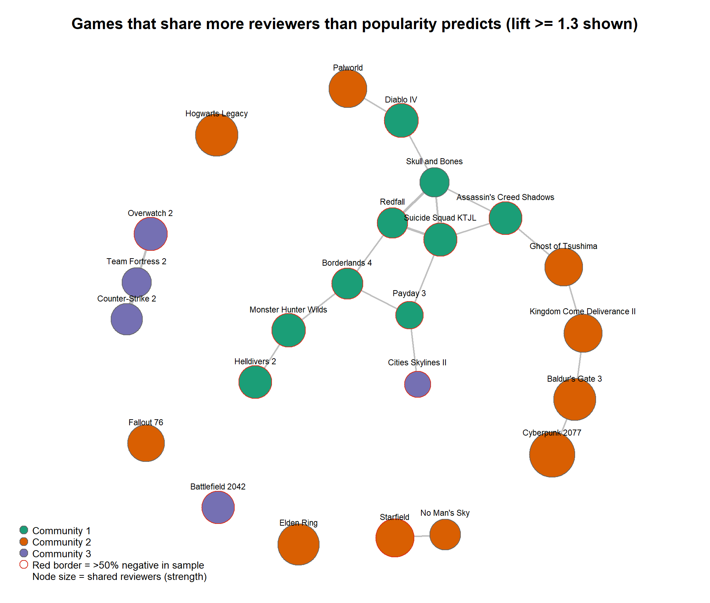
```

Louvain community detection (Blondel et al., 2008) on the lift-weighted network found three communities with modularity Q = 0.113 (Newman, 2006). To test whether this structure is real, we compared it with 200 null networks in which the games reviewed by each multi-game reviewer were randomly shuffled, preserving how many games each user reviewed and how often each game was reviewed. The null networks had mean Q = 0.026 (95th percentile 0.035), so the observed community structure is very unlikely to arise by chance (p < 0.005).

The three communities have a clear interpretation:

- **Community 1** contains the 2023–25 live-service, looter and co-op action releases (Helldivers 2, Diablo IV, Payday 3, Borderlands 4, Suicide Squad, Skull and Bones, Redfall, Monster Hunter Wilds) and Assassin's Creed Shadows.
- **Community 2** contains the open-world and role-playing games (Baldur's Gate 3, Cyberpunk 2077, Elden Ring, Starfield, Fallout 76, Hogwarts Legacy, Kingdom Come: Deliverance II, Ghost of Tsushima, No Man's Sky, Palworld).
- **Community 3** contains the long-running competitive multiplayer games (Counter-Strike 2, Team Fortress 2, Overwatch 2, Battlefield 2042) together with Cities: Skylines II.

Reviewers therefore do not spread their attention evenly: players group by the type of game they play, even though every game in the set is popular. The strongest ties in Figure 10 fit this reading, for example Overwatch 2–Team Fortress 2–Counter-Strike 2, and the triangle of poorly received 2023–24 releases Suicide Squad–Redfall–Skull and Bones. Cities: Skylines II is the one surprising member of Community 3; its ties are weak, and it is better seen as loosely attached.

Getting to this result needed two corrections, which shows why a null model matters. On raw shared-reviewer counts, Louvain found intuitive-looking groups, but their modularity (0.086) was *lower* than that of randomly rewired networks (0.12), because the counts mostly reflect popularity. After switching to lift, we first kept only edges with lift above 1. This also looked convincing (Q = 0.46), but random networks thinned in the same way scored just as high (0.46), because any sparse graph splits easily into modules. Only the full lift-weighted network gives a structure clearly stronger than chance, so thresholds are used only for drawing the figures.

## 7.4 Do connected games share complaints?

This links the network to the clustering. For every pair of games we compared their lift (shared players) with the cosine similarity of their complaint profiles (Section 6). The Spearman correlation was positive (rho = 0.26), and a permutation test that shuffles game labels (2,000 permutations; a QAP-style test, Krackhardt, 1988) gave p = 0.001: **games that share players are also criticised for similar things.**

```{r fig-net-neg, fig.cap="Games linked by reviewers who were negative about both (lift >= 1.5 shown).", out.width="62%"}
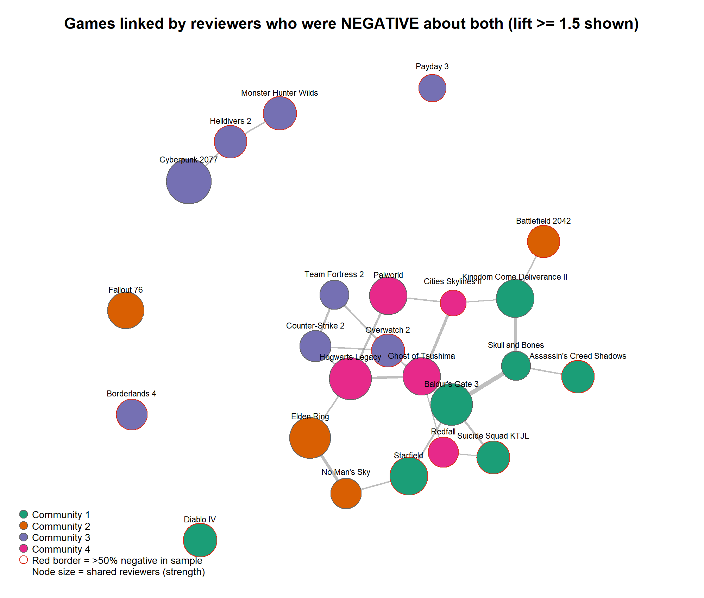
```

The network of shared *negative* reviewers (Figure 11) has a different shape from the full network. One of its communities joins the competitive shooters (Counter-Strike 2, Overwatch 2, Team Fortress 2) with games criticised for updates, servers or performance (Helldivers 2, Payday 3, Monster Hunter Wilds, Borderlands 4, Cyberpunk 2077). Together with the correlation above and test H5 in Section 8, this suggests that dissatisfied players bring the same expectations from game to game.

Most multi-game reviewers are not serial complainers, however. `r pct(mean(cons$s == 0))` were positive about every game they reviewed, `r pct(mean(cons$s == 1))` were negative about every game, and `r pct(mean(cons$s > 0 & cons$s < 1))` gave mixed recommendations. One limitation is that only reviewers who appear in our sample can be linked, so the network captures only a small fraction of the real overlap between audiences. More reviews per game would give a denser and more reliable network.

# 8. Statistical Tests (RQ5)

Reviewer-behaviour tests use the **recent-review sample** (newest 500 per game, `r fmt(sum(rev$source == "recent"))` reviews), because the "most helpful" sample was selected on helpfulness and over-represents negative reviews. Results on the full sample are shown as a robustness check. Playtime and review length are highly right-skewed, so Wilcoxon rank-sum tests were used instead of t-tests.

```{r stats-table}
st <- stats %>% transmute(Hypothesis = test, Sample = sample, `p-value` = p_value, Effect = effect)
ktab(st, "Summary of hypothesis tests.", "p{6.1cm}p{1.9cm}p{1.3cm}p{6cm}")
```

```{r fig-play, fig.cap="Hours played when the review was written (recent-review sample, log scale).", out.width="40%"}
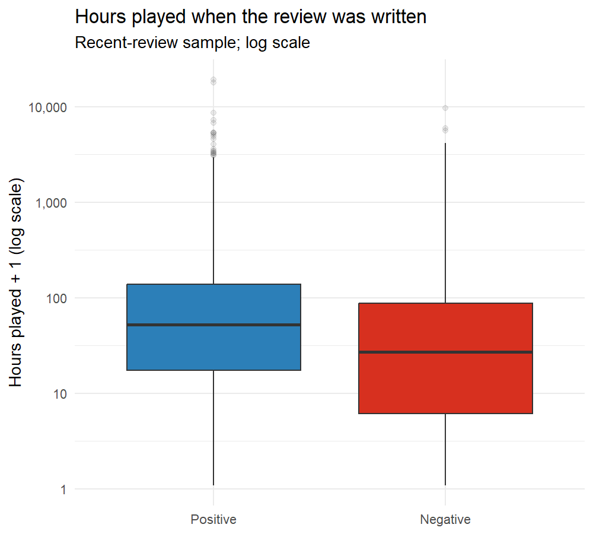
```

The recent sample shows a median of 26.2 hours played by negative reviewers and 51.5 hours for positive reviewers (Wilcoxon, p < 10^-16^), with the same results from the full sample (25.0 vs 56.6 hours). In the games, negative reviewers had played less in 21 of 24 games, significantly, in 12 (after Holm correction for 24 tests). The difference is that they leave negative games short before they are finished rather than that negative games are games they leave unfinished, it is not the difference between games and the people who quit. The three exceptions are telling: in the case of Counter-Strike 2 (487 vs 100 hours), Helldivers 2 (124 vs 54) and Team Fortress 2 (49 vs 35), negative reviewers had played for longer than the positive ones. These are the games that had the spikes as protests against decisions impacting an established community. It was not the new guys who were resisting there, it was the long-term players.

The median length of the reviews in the negative reviews was 24 words versus 8 words in the positive ones (p < 10^-16^); in the full sample (which includes most of the longer "helpful" reviews, the median was 82 words versus 52 words in the negative reviews). There must be an explanation for a complaint, and a word of approval for an approval.

In this recent sample, negative reviews were more likely to have at least one helpful vote than positive reviews (chi-squared, p < 10^-16%): 65.3% vs. 16.3%. Negative reviews were significantly more likely to get one or more of the helpful votes. This association needs to be read in conjunction, as the review length and review age have an impact on helpfulness, and negative reviews are more helpful, which is why this is only partially consistent with the longer reviews seen in H2.

Players who received the game for free were less positive (32.4% vs 57.0%) when compared to reviewers who did not receive the game for free. The free games, however, are heavily skewed toward a few games (Fallout 76, Diablo IV and Redfall), all of which have poor ratings, and this comparison is combining "free" with "which game". The Cochran–Mantel–Haenszel test is used to compare the free reviewers with the paid reviewers in each game and to combine the result. It validates the effect: those who were paid reviewers were 2.16 times (95% CI 1.92–2.42) more likely to have a positive review. Part of the reason might be that the player paid for it, and is more invested in it, and another might be that the free copy is distributed to the players via a bundle, a promotion, or via keys that the player didn't specifically request.

A chi-squared test was conducted on the 9×3 table, and the test was significant at the p < 10^-16^ level with Cramér's V = 0.43, a strong association. The standardised residuals highlight the complaints that are associated with each community:

The space & exploration and story & content ( +18 / +50) categories are over-represented in the Open world/RPG community.
Competitive multiplayer community (-46), monetisation (-30) and patches & dev decisions (-18).
Live-service/co-op launch community: always-online & servers (+22), PC performance (+17) and crashes (+11).

The communities were identified by looking at the behaviour; they also have different concerns. This p-value is an overestimate of the certainty because reviews of the same game are not independent; the game-level permutation test in Section 7.4 is a more conservative test of the same idea.

Ten of thousands of observations means that any difference is statistically significant, which means the effect sizes are more important than the p-values. All of them (the medians, percentages, odds ratio and Cramér's V) are large.
# 9. Discussion and Conclusion

## 9.1 Answering the research questions

This study indicates that Steam review negativity does not indicate whether or not players enjoy the game itself. The most pronounced negative drops were seen in relation to specific controversies in the 24 games that were purposefully selected across a range of platform and account policies, monetisation decisions, server failures, cheating/grift, technical performance and underpromised launches. RQ1 thus proposes that review-bombing is more likely to be induced by choices and situations associated with a game, as opposed to creative excellence. The spike detector also suggested that there were differences between short duration protests and longer duration of dissatisfaction: decision-driven negativity tended to be contained over a small time window (in this case, a few months), while technical and launch negativity tended to be more persistent.

In RQ2, the analysis of the text reveals the difference between negative and positive review vocabulary. Negative reviews had more likely to use words related to companies, companies refunds, monetisation, technical issues, and post-release changes, whereas positive reviews had more likely to use aesthetic and emotional language. The TF-IDF analysis also revealed that the words of each individual game are quite unique. Examples include PSN and Sony games for Helldivers 2 and Ghost of Tsushima, bots and cheaters in Team Fortress 2 and Counter-Strike 2. This is a confirmation of the idea that the players talk about the games in a recognisably different way, rather than in a uniform vocabulary of dissatisfaction.

RQ3 questioned if it was possible to categorize negative reviews into meaningful complaint types. The k-means analysis revealed nine themes that were interpretable, but the silhouette values were low and the values were not particularly stable; these should be understood as broad patterns rather than as sharply separated categories. The majority of games featured a familiar grievance: cheaters and bots in TF2 and Counter-Strike 2, servers in Payday 3, monetisation in Overwatch 2, Diablo IV and Borderlands 4, and PC performance in Monster Hunter Wilds. The complaints profiles were also broadly consistent with the controversies that were found in the time-trend analysis. The uniformity of methods increases the strength of the interpretation and the grouping restrictions indicate that a review that mentions multiple issues should not be interpreted to be only one complaint.

The shared-reviewer network shows that audiences of players are overlapping in structured ways for RQ4. The raw shared-reviewer counts were strongly influenced by game popularity, and were analysed against null networks, using lift-weighted edges. This gave rise to three communities that were generally modelled after live-service/co-op action games, open world/RPG games, and lengthy competitive multiplayer games. Importantly, there was also a correlation between the number of overlapping reviewers and the similarity of profiles of complaints (Spearman rho = 0.26; permutation p = 0.001). This means that players might have specific expectations from one game to another that correspond to a specific genre. The finding is not causal, but associative in nature: it does not imply that a player's specific type of complaint is causal to their membership in a specific community.

RQ5 found systematic differences between negative and positive reviewers. The reviewers of the sample with more recent reviews tended to have lower median playtime, longer reviews and more helpful votes than the negative reviewers. The free-copy analysis also detected a negative correlation between reviewers receiving a game for free and its positivity, which could be due to the tendency of free games to be concentrated in certain games. Most important of all, the playtime negative ratings were not universal, as in Counter-Strike 2, Helldivers 2 and Team Fortress 2, negative reviews had recorded more playing time than positive reviews. These exceptions are in line with the notion that an established player can be a great critic when a decision could affect an existing community or alter a familiar game.

The results indicate that Steam reviews can be used as a product feedback and as a joint protest at the same time. It's not just that people are rejecting poor quality games. Rather, the backlash typically occurs when players feel that expectations are not being met by the publisher with regard to an aspect of the game that they are interested in, such as the price, technical implementation, monetization, access, or continuing support. Communities of players also seem to have different expectations and these expectations are evident in their complaints that they voice across games. The practical impact for developers and publishers is that checking only the overall review score isn't enough; an unexpected or large drop in the number of reviews and/or complaints in a particular vocabulary may indicate a particular issue or a community grievance.

## 9.2 Limitations

There are some caveats to consider when interpreting these results. The first being the purposive selection of first 24 games due to their association with public controversy, control or redemption stories. The results are thus not necessarily representative of Steam in general, and should not be extrapolated to other games or other Steam review-bomb situations. Secondly, the monthly Steam histogram includes the reviews in all languages, while the text for the review was limited to English. This distinction becomes especially significant in cases of controversial content that is made public in the international arena, like the Helldivers 2 PSN protest.

Third, up to 1,500 reviews ranked by helpfulness were used to create the review-text sample, along with the 500 newest reviews. This sampling strategy over-represents certain types of reviews due to the association between helpfulness and length of recommendation/review. Therefore, the report is based on the lifetime histogram for review-share estimates, but the text analyses are based on the recent-review sample, and should still be interpreted as analyses of the collected sample and not as a census of all Steam reviews. Fourth, the data are taken on 29 Sept 2026. Reviews can be edited or deleted and recent-review samples will be subject to change.

There are limitations to the text methods too. The Bag-of-words and TF-IDF representations are not sufficient to reflect word order, sarcasm or negation well. The k-means solution was interpretable but moderately stable (ARI = 0.67), and it was not possible to assign all of the reviews to a single cluster as the reviews which mention multiple complaints cannot be represented by a single cluster. The network analysis is only able to detect reviewer overlap among the games included in the sample of games and cannot see players who reviewed relevant games not included in the sample. Last but not least, Steam reviews might be spam, organized activity or any other non-organic action that is hard to detect by available metadata. The observational design is also such that correlations and associations are not able to show a cause-and-effect relationship.

## 9.3 Further work

The analysis could be continued in multiple directions in the future. Firstly, topic models like LDA would allow for multiple complaints to be assigned to the same review, rather than each review being forced into one k-means cluster. Beyond bag-of-words features, transformer-based language models or sentiment methods that are able to process negation and context could further enhance the analysis of review meaning.

Second, gathering all the reviews for the months indicated as spikes would enable for a direct comparison between review-bomb text and regular negative reviews. This would give a greater indication of whether the vocabulary of a protest is different from the normal grievance. The network communities and the complaint profiles would also be more representative if more games of the various genres were added to the dataset. For the controversies where the audience is international, such as Helldivers 2 PSN, a multilingual analysis would be of great value.

Last but not least, a long-term study of the reviewer level analysis could be conducted to see if there was any difference in the recommendations before a controversy, during the controversy, or after the controversy when the publisher reversed their recommendation or enhanced a game. The present study offers a natural starting point for this type of work by examining the redemption games. Using the sentiment of reviews as well as the type of complaint and the actions of the players throughout the game's history may help determine if the protest is temporary or if it is lasting and that may help to better understand the reaction of the player communities to recoveries.

# References {-}

\small

Blondel, V. D., Guillaume, J.-L., Lambiotte, R., & Lefebvre, E. (2008). Fast unfolding of communities in large networks. *Journal of Statistical Mechanics: Theory and Experiment, 2008*(10), P10008.

Csardi, G., & Nepusz, T. (2006). The igraph software package for complex network research. *InterJournal, Complex Systems*, 1695.

Feinerer, I., Hornik, K., & Meyer, D. (2008). Text mining infrastructure in R. *Journal of Statistical Software, 25*(5), 1–54.

Game Informer. (2024, May 6). *PlayStation walks back Helldivers 2 changes, PSN account linking no longer required.* https://gameinformer.com/news/2024/05/06/playstation-walks-back-helldivers-2-changes-psn-account-linking-no-longer-required

Game World Observer. (2023, August 11). *Overwatch 2 launches on Steam with just 15% positive reviews, worst result of any release in 2023.* https://gameworldobserver.com/2023/08/11/overwatch-2-worst-steam-release-2023-negative-reviews

Game World Observer. (2024, May 6). *Helldivers 2 players prove review bombing can lead to positive change, as Sony drops PSN linking requirement.* https://gameworldobserver.com/2024/05/06/helldivers-2-psn-linking-removed-review-bombing-positive

GameSpot. (2023). *Overwatch 2 is Steam's worst user-reviewed game of all time, but for a surprising reason.* https://www.gamespot.com/articles/overwatch-2-is-steams-worst-user-reviewed-game-of-all-time-but-for-a-surprising-reason/1100-6516849/

Hubert, L., & Arabie, P. (1985). Comparing partitions. *Journal of Classification, 2*(1), 193–218.

Kain, E. (2016, August 30). Steam clamps down on 'No Man's Sky' refunds. *Forbes.* https://www.forbes.com/sites/erikkain/2016/08/30/steam-clamps-down-on-no-mans-sky-refunds/

Kain, E. (2023, September 28). 'Counter-Strike 2' has launched but at a terrible cost and with little to show for it. *Forbes.* https://www.forbes.com/sites/erikkain/2023/09/28/counter-strike-2-has-launched-but-at-a-terrible-cost-and-with-little-to-show-for-it/

Krackhardt, D. (1988). Predicting with networks: Nonparametric multiple regression analysis of dyadic data. *Social Networks, 10*(4), 359–381.

Monroe, B. L., Colaresi, M. P., & Quinn, K. M. (2008). Fightin' words: Lexical feature selection and evaluation for identifying the content of political conflict. *Political Analysis, 16*(4), 372–403.

Newman, M. E. J. (2006). Modularity and community structure in networks. *Proceedings of the National Academy of Sciences, 103*(23), 8577–8582.

PC Gamer. (2018). *CS:GO receives 14,000 negative Steam reviews in a single day after going free to play.* https://www.pcgamer.com/csgo-receives-14000-negative-steam-reviews-in-a-single-day-after-going-free-to-play/

PC Gamer. (2023). *Payday 3 slammed on Steam by players forced to wait in server queues just to play by themselves.* https://www.pcgamer.com/payday-3-nebula-server-errors/

PC Gamer. (2024a). *Team Fortress 2 plummets to 'Overwhelmingly Negative' on Steam as its biggest fans stoke the righteous flames of anti-bot outrage.* https://www.pcgamer.com/games/fps/team-fortress-2-plummets-to-mostly-negative-on-steam-as-its-biggest-fans-stoke-the-righteous-flames-of-anti-bot-outrage/

PC Gamer. (2024b). *Paradox apologizes for latest Cities: Skylines 2 boondoggle, will give refunds for the Beach Properties DLC.* https://www.pcgamer.com/games/sim/paradox-apologizes-for-latest-cities-skylines-2-boondoggle-will-give-refunds-for-the-beach-properties-dlc-we-hope-we-can-regain-your-trust-going-forward/

PC Gamer. (2024c). *Ghost of Tsushima's PC port has been delisted in nearly 200 countries and territories without PSN access, even though most of the game won't require a sign-in.* https://www.pcgamer.com/games/action/ghosts-of-tsushimas-pc-port-has-been-delisted-in-nearly-200-countries-and-territories-without-psn-access-even-though-most-of-the-game-wont-require-a-sign-in/

Porter, M. F. (1980). An algorithm for suffix stripping. *Program, 14*(3), 130–137.

R Core Team. (2026). *R: A language and environment for statistical computing* (Version 4.6.1). R Foundation for Statistical Computing.

Rousseeuw, P. J. (1987). Silhouettes: A graphical aid to the interpretation and validation of cluster analysis. *Journal of Computational and Applied Mathematics, 20*, 53–65.

Valve Corporation. (n.d.). *User reviews – Get list.* Steamworks Documentation. https://partner.steamgames.com/doc/store/getreviews

Variety. (2019, March 15). *Off-topic 'review bombs' no longer affect game scores on Steam.* https://variety.com/2019/gaming/news/steam-off-topic-review-bombing-1203164639/

Wickham, H. (2016). *ggplot2: Elegant graphics for data analysis.* Springer.

Windows Central. (2025). *Monster Hunter Wilds game reviews hit "Overwhelmingly Negative" on Steam — can Capcom turn it around?* https://www.windowscentral.com/gaming/monster-hunter-wilds-reviews-hit-overwhelmingly-negative-on-steam-players-decry-the-games-poor-endgame-and-pc-performance

\normalsize

# Appendix A: Reproducing the analysis {-}

All code is in the project folder and runs in this order: `collect_steam.py` (data collection, Python 3), then `run_all.R`, which runs `01_clean.R`, `02_timetrend.R`, `03_textmining.R`, `04_clustering.R`, `04b_cluster_profiles.R`, `05_network.R` and `06_stats.R`. `stability_check.R` reproduces the k-means stability check. The collection date (29 September 2026) matters: re-running `collect_steam.py` later will return a different set of recent reviews. All random steps (k-means, permutation tests, null models) use fixed seeds, so the analysis scripts reproduce the reported results from the saved data.
